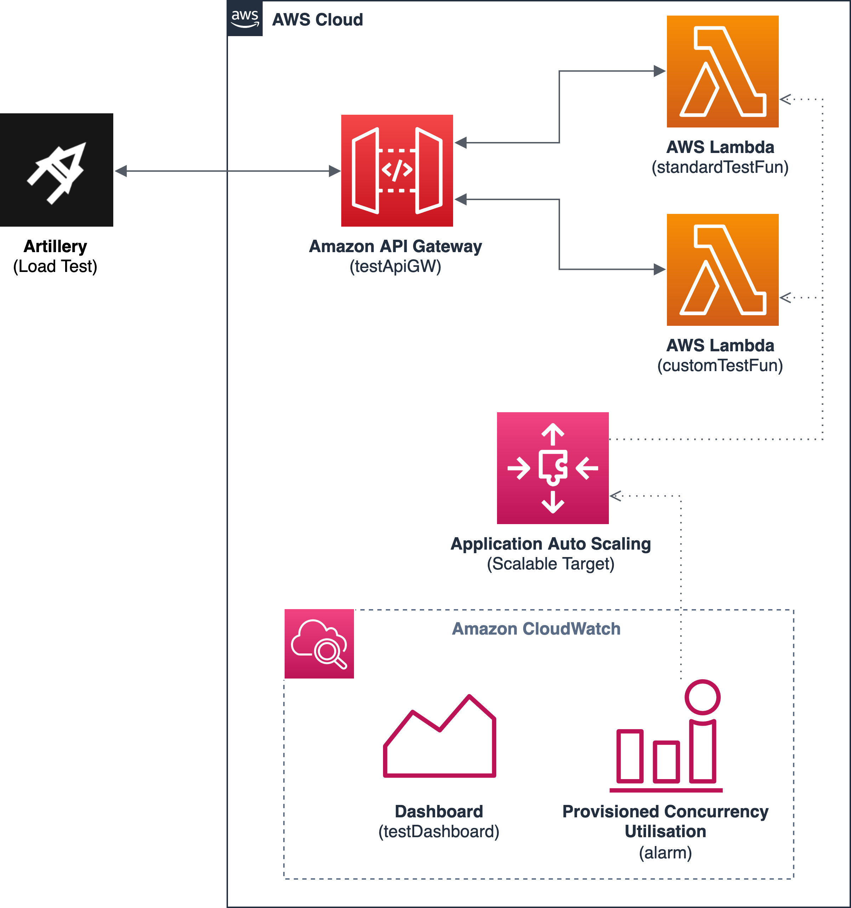

# Autoscale AWS Lambda provisioned concurrency

Provisioned concurrency is a way to prepare certain number of AWS Lambda execution environments in advance to respond immediately to incoming requests. It’s a way to minimise impact of a cold start on response latency. Application Auto Scaling allows to manage provisioned concurrency on a schedule or based on utilisation. In this pattern I will show how to use Amazon CloudWatch monitoring features and Artillery load test framework to fine tune utilisation based autoscaling.

## Prerequisites
Before start make sure you have installed following tools:
* [AWS CDK 2.20.0](https://aws.amazon.com/cdk/)
* [Node.js 16.13.2](https://nodejs.org/)
* [Artillery 2.0.0](https://www.artillery.io/)

To make life easier it is recommended to also have:
* [jq 1.6](https://stedolan.github.io/jq/download/)

## Installation
To install app dependencies run `npm i`.

## Architecture

Target architecture is a simplistic representation of a backend application. Amazon API Gateway is the entry point for the end client - in this case this will be Artillery.io test framework. The API exposes two endpoints /custom and /standard which are backed by AWS Lambda functions. Each of them is actually the same code doing nothing except sleeping for a defined amount of time to simulate latency. The only difference lays in the autoscaling setting that we want to compare.

Provisioned concurrency for each Lambda function is initially set to 1. Application Auto Scaling is responsible of scaling it up and down based on the Provisioned Concurrency Utilisation metric. The standardTestFun uses predefined settings for Provisioned Concurrency Utilisation metric which means the alarm is set on when three consecutive data points are above threshold. Each data point is the average utilisation over a one minute window. The customTestFun uses custom metric. The alarm is also set on when three consecutive data points are above the same threshold but this time each data point is calculated as the maximum utilisation. This makes the auto scaling more responsive to even short spikes in traffic load.

The observability part comes with an Amazon CloudWatch Dashboard that consists of several widgets presenting useful metrics:
* Api Latency: Latency is the time between when API Gateway receives a request from a client and when it returns a response to the client. Integration latency is the time between when API Gateway relays a request to the backend and when it receives a response from the backend. The latency includes the integration latency and other API Gateway overhead.
* Api Number of Calls: Count is the total number of API requests in a given period (in this example 30 seconds). 4XXError is the number of client-side errors and 5XXError is the number of server-side errors captured in a given period.
* Api Calls Per Second: This is the calculation done to illustrate number of API request per second
* Lambda Duration: Avarage and maximum duration time for each function
* Lambda Invocations: Graphs without suffix present total number of invocations for each function. The '-Spillover' graphs show how many invocation are against instances that are not in the Provisioned pool.
* Lambda Concurrent Executions: Graphs without suffix show number of parallel Lambda instances being executed. The -'Provisioned' graphs show how many of those parallel Lambdas are from Provisioned pool.
* Summary: These are the calculations from the API access logs for each endpoint showing time statistic.

Using these metrics one can observe how the scaling performs during different load, how this influences latency and in the end fine tune the desired autoscaling behaviour. For example on above picture you can see that with each spike the customFun uses more and more provisioned instance because this metric is more sensitive in scaling on spikes.
## Usage
Deploy this stack to your AWS account
```bash
cdk deploy -O output.json
```
Run load tests. Script extracts API Gateway url from output.json
```bash
./run_artillery.sh load-test-spikes.yaml
```
Clean up
```bash
cdk destroy && rm ./output.json
```

## Security

See [CONTRIBUTING](CONTRIBUTING.md#security-issue-notifications) for more information.

## License

This library is licensed under the MIT-0 License. See the LICENSE file.

